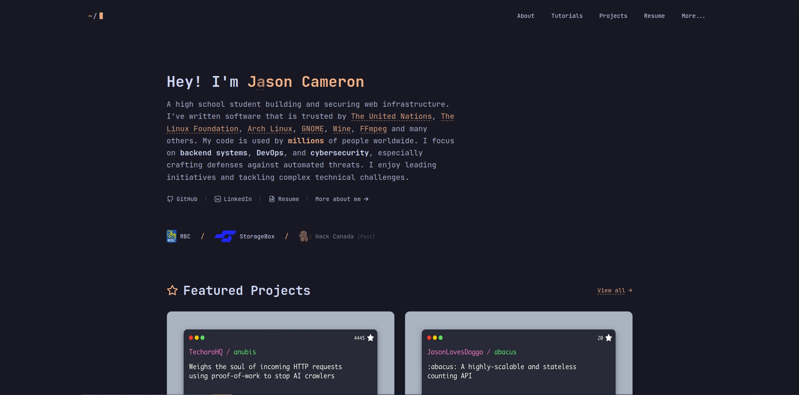

# Nyx

Nyx is my personal digital playground and the third iteration of my portfolio, designed to showcase my projects,
experiments, and journey in the world of software development.

  
  
  
  

## Inspirations

Nyx draws inspiration from various innovative websites and projects. To view my wild brainstorming process, check out
the <a target="_blank" href="https://notes.jasoncameron.dev/Website">Ideas Board</a>.

---

Thank you for visiting — and please leave a ⭐ if you likey!
